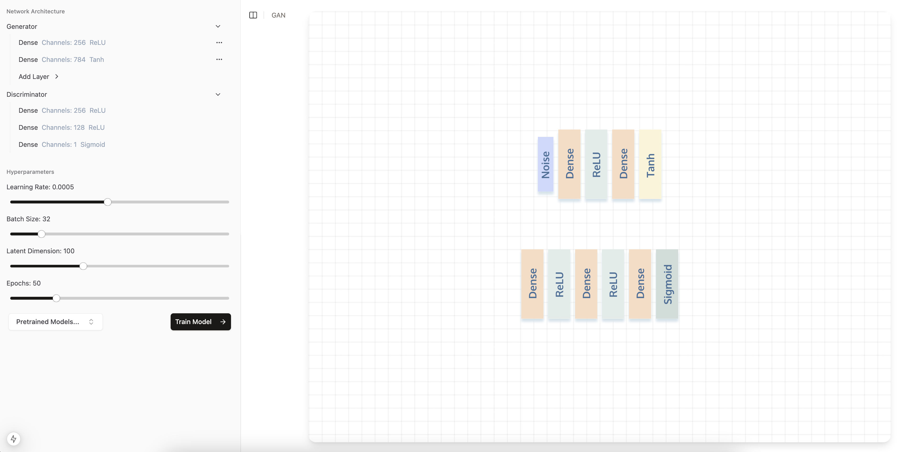

# NeurViz 
## An Interactive Playground for Building Deep Learning Models 
Built using the following techstack: 
- Framework - [Next.js 14](https://nextjs.org/13)
- Language - [TypeScript](https://www.typescriptlang.org) and [Python](https://www.python.org/)
- Styling - [Tailwind CSS](https://tailwindcss.com)
- Components - [Shadcn-ui](https://ui.shadcn.com)
- Neural Networks - [Pytorch](https://pytorch.org/)
- Backend APIs - [Flask](https://flask.palletsprojects.com/en/stable/)
- Deployment - Coming Soon!

## GANs 

Design and build Generative Adversarial Networks (GANs) through an interactive user interface. Visualize the neural networks for both the generator and discriminator in real-time.

## Features 
- Support for various linear and convolutional layers. 
- Batchnorms for convolutional layers. 
- Various activation functions (ReLU, PReLU, LeakyReLU, Tanh, Sigmoid).
- Tuning hyperparameters and setting latent noise dimension.

## Features Coming Soon 
- Support for autoencoders.
- More layer types.
- Drag and drop editting for layers with implicit channels.

## Deployment 
Currently work in progress, will be deployed using Vercel for the front end and a Dockerfile will be provided for the Flask backend. To run locally, clone the project and run
```
cd frontend
npm run dev
cd ...
cd backend 
python app.py
```